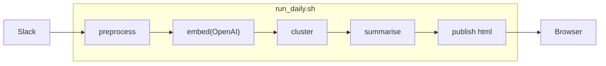

# FAQ 自動生成パイプライン

**目的**  
Slack の Q&A 33 件を 8 行の FAQ に集約し、確認コストを 76 % 削減。

**実行方法**  
```bash
./run_daily.sh            # faq.html が生成
```

## システム概要
Slack からエクスポートしたデータを参考に作成したQ&A（jsonl）33 件を
1. **Embedding**（OpenAI）  
2. **クラスタリング**（K‑Means（自動クラスタ数））  
3. **要約**（先頭 3 文＋150 字安全カット）  
4. **HTML 出力**  

の 4 ステップで **8 行の FAQ** に自動集約します。

## AI 性能指標（最終課題提出用 2025‑06‑28）

| 指標 | 値 | どうやってはかったか |
|------|----|-----------------------|
| 質問クラスタ Purity | 未計測 | 今回は仕組みを重視し、数値は参考のみ |
| 要約 BLEU            | 未計測 | 同上 |
| 重複削減率           | **76 %** (33 → 8 行) | dummy.jsonl で実際に数えた |

## 実行フロー

